# เอกสารขอบเขตงาน (Terms of Reference: TOR)

## โครงการพัฒนาเว็บทำข้อสอบออนไลน์ (quizWeb)

---

## 1. ข้อมูลทั่วไปของโครงการ

ชื่อโครงการ: โครงการพัฒนาเว็บทำข้อสอบออนไลน์ (quizWeb)
ลักษณะโครงการ: โครงการพัฒนาเว็บเพื่อการศึกษา
เทคโนโลยีหลัก: Node.js และ Web-based Application

---

## 2. รายชื่อสมาชิกกลุ่ม

1. นางสาวแพรวปภัสสร ว่องธนากิจ 67102010524
2. นางสาวภัทรธิดา จารุจิตจำเริญ 67102010525
3. นางสาวศรุชา วิริยะจิตต์ 67102010531

---

## 3. ที่มาและความสำคัญของโครงการ

ในปัจจุบัน การเรียนการสอนออนไลน์มีบทบาทสำคัญอย่างยิ่ง โดยเฉพาะระบบการทำข้อสอบออนไลน์ที่ถูกนำมาใช้อย่างแพร่หลาย อย่างไรก็ตาม ระบบทำข้อสอบจำนวนมากยังขาดการแสดงผลการวิเคราะห์คะแนนและสถิติที่ชัดเจน เช่น คะแนนเฉลี่ย คะแนนสูงสุด และคะแนนต่ำสุด ส่งผลให้ผู้เรียนไม่สามารถประเมินผลการเรียนรู้ของตนเองได้อย่างมีประสิทธิภาพ

ดังนั้น โครงการ quizWeb จึงมีวัตถุประสงค์เพื่อพัฒนาเว็บทำข้อสอบออนไลน์ที่สามารถตรวจคำตอบ คำนวณคะแนน และวิเคราะห์ผลคะแนนในรูปแบบสถิติได้โดยอัตโนมัติ เพื่อเพิ่มประสิทธิภาพในการเรียนรู้ของผู้เรียนและลดภาระงานของผู้สอน

---

## 4. วัตถุประสงค์ของโครงการ

### 4.1 วัตถุประสงค์หลัก

* เพื่อพัฒนาเว็บทำข้อสอบออนไลน์โดยใช้ Node.js
* เพื่อสร้างระบบตรวจคำตอบและคำนวณคะแนนอัตโนมัติ
* เพื่อแสดงผลการวิเคราะห์คะแนนสอบในรูปแบบสถิติ

### 4.2 ประโยชน์ที่คาดว่าจะได้รับ

* ผู้เรียนสามารถประเมินผลการเรียนรู้ของตนเองได้อย่างชัดเจน
* ช่วยลดภาระในการตรวจข้อสอบของผู้สอน
* ผู้พัฒนาได้ฝึกทักษะการทำงานเป็นทีม การพัฒนาเว็บ และการใช้งาน GitHub

---

## 5. ขอบเขตของงาน (Scope of Work)

### 5.1 ขอบเขตงานที่ดำเนินการ (In Scope)

* ระบบทำข้อสอบแบบปรนัย (Multiple Choice)
* ระบบตรวจคำตอบอัตโนมัติ
* ระบบคำนวณและแสดงคะแนนสอบ
* ระบบแสดงสถิติพื้นฐาน ได้แก่ คะแนนเฉลี่ย (Average), คะแนนสูงสุด (Max) และคะแนนต่ำสุด (Min)
* ระบบสมัครสมาชิก เข้าสู่ระบบ และออกจากระบบ
* ระบบจัดการควิซและคำถาม

### 5.2 ขอบเขตงานที่ไม่ดำเนินการ (Out of Scope)

* ระบบชำระเงิน
* ระบบสมัครสมาชิกขั้นสูง
* ระบบสอบที่มีความซับซ้อน เช่น การสอบอัตนัย หรือการจับเวลาแบบพิเศษ

---

## 6. ความต้องการของระบบ (System Requirements)

### 6.1 Functional Requirements

* ระบบต้องให้ผู้ใช้สมัครสมาชิก เข้าสู่ระบบ และออกจากระบบได้
* ระบบต้องให้ผู้ใช้สร้าง แก้ไข และลบคำถามในควิซได้
* ระบบต้องให้ผู้ใช้ตั้งค่าควิซ บันทึกแบบร่าง และเผยแพร่ควิซได้
* ระบบต้องแสดงรายการควิซและให้ผู้ใช้เริ่มทำควิซได้
* ระบบต้องแสดงเวลาที่เหลือระหว่างทำควิซ และส่งคำตอบอัตโนมัติเมื่อหมดเวลา
* ระบบต้องคำนวณและแสดงคะแนนหลังจากผู้ใช้ส่งควิซ
* ระบบต้องแสดงประวัติการสร้างควิซและประวัติการทำควิซของผู้ใช้
* ระบบต้องให้ผู้ดูแลระบบสามารถจัดการผู้ใช้ ควิซ และดูรายงานของระบบได้

### 6.2 Non-Functional Requirements

* ระบบต้องมีความปลอดภัย โดยมีการยืนยันตัวตนและกำหนดสิทธิ์การใช้งาน
* ระบบต้องใช้งานง่ายและแสดงข้อมูลสำคัญอย่างชัดเจน
* ระบบต้องตอบสนองรวดเร็วและรองรับผู้ใช้งานหลายคนพร้อมกัน
* ระบบต้องมีความน่าเชื่อถือและไม่สูญหายของข้อมูล
* ระบบต้องสามารถขยายและปรับปรุงฟีเจอร์ในอนาคตได้

---

## 7. โครงสร้างข้อมูลที่ใช้ในระบบ (Data Structure)

* **Question**: ใช้เก็บข้อมูลคำถาม ตัวเลือกคำตอบ และคำตอบที่ถูกต้อง
* **Quiz**: ใช้เก็บข้อมูลชุดข้อสอบที่ประกอบด้วยคำถามหลายข้อ
* **Result**: ใช้เก็บข้อมูลผลลัพธ์การทำข้อสอบ เช่น คะแนน และสถิติของผู้ใช้

โครงสร้างข้อมูลดังกล่าวถูกนำมาใช้ในการตรวจคำตอบ การคำนวณคะแนน และการแสดงผลสถิติ

---

## 8. Use Case ของระบบ

**Actor หลัก:** ผู้ใช้ (User)

**Use Case หลัก:**

* เริ่มทำข้อสอบ
* ตอบคำถามในข้อสอบ
* ส่งคำตอบ
* ดูคะแนนสอบ
* ดูสถิติผลคะแนน (Average, Max, Min)

---

## 9. กระบวนการพัฒนาและเครื่องมือที่ใช้

* ใช้กระบวนการพัฒนาแบบ Agile
* ใช้ GitHub Repository สำหรับควบคุมเวอร์ชันและทำงานร่วมกันภายในทีม
* ใช้ Web Browser เป็นช่องทางหลักในการเข้าถึงระบบ
* พัฒนา Frontend หน้าเว็บไซต์
   - CSS, HTML, JavaScript (VS Code)
* พัฒนา Backend
   - JavaScript (Node.js)
   - Framework (Express.js)
  ใช้รับคำขอจากผู้ใช้, ตรวจคำตอบ, คำนวณคะแนน, ส่งผลคะแนนกลับไป
* พัฒนา Database
   - 
* ใช้ Web Browser เป็นช่องทางหลักในการเข้าถึงระบบ

---

## 10. สรุปขั้นตอนการจัดทำ Requirement

การจัดทำ Requirement ของโครงการเริ่มจากการสัมภาษณ์ผู้ใช้งานกลุ่มเป้าหมาย เพื่อรวบรวมความต้องการของระบบ จากนั้นนำข้อมูลมาวิเคราะห์และจัดทำเป็น Functional และ Non-Functional Requirements รวมถึงกำหนดขอบเขตของโครงการให้ชัดเจน โดยมีการบันทึกขั้นตอนดังกล่าวเป็นวิดีโอประกอบ

ลิงก์วิดีโอการสัมภาษณ์: https://youtu.be/3tyhzvMVRvY

---

## 11. สรุปผลการประชุม Retrospective Phase 1

ทีมงานได้มีการจัดประชุม Retrospective หลังการดำเนินงานในแต่ละช่วง โดยมีข้อสรุปดังนี้

* **สิ่งที่ทำได้ดี:** การสื่อสารภายในทีมและการแบ่งหน้าที่ชัดเจน
* **สิ่งที่ควรปรับปรุง:** การวางแผนเวลาในการพัฒนาให้รัดกุมมากขึ้น
* **แนวทางการพัฒนาในอนาคต:** ปรับปรุงกระบวนการทำงานให้มีประสิทธิภาพและลดปัญหาที่อาจเกิดขึ้นซ้ำ

ลิงก์วิดีโอ Retrospective: https://youtu.be/8sUTdzBlkeQ?si=CepGhHKbjgSgSOSg

---

## 12. Design Document

### 12.1 Architectural Design

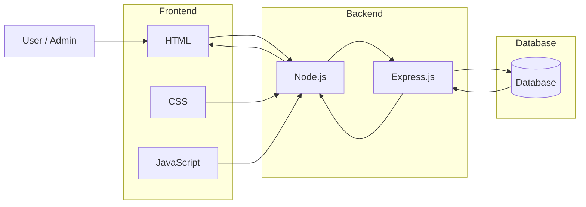
```mermaid
flowchart LR

User[User / Admin]

subgraph Frontend
    A[HTML]
    B[CSS]
    C[JavaScript]
end

subgraph Backend
    D[Node.js]
    E[Express.js]
end

subgraph Database
    F[(Database)]
end

User --> A
A --> D
B --> D
C --> D
D --> E
E --> F
F --> E
E --> D
D --> A
```

### 12.2 Use Case Diagram

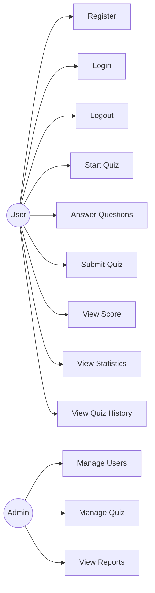
```mermaid
flowchart LR

User((User))
Admin((Admin))

User --> Register[Register]
User --> Login[Login]
User --> Logout[Logout]

User --> StartQuiz[Start Quiz]
User --> Answer[Answer Questions]
User --> Submit[Submit Quiz]

User --> ViewScore[View Score]
User --> ViewStats[View Statistics]
User --> History[View Quiz History]

Admin --> ManageUsers[Manage Users]
Admin --> ManageQuiz[Manage Quiz]
Admin --> ViewReports[View Reports]
```
---

## 13. Figma screenshot

หน้า index ที่ยังไม่ได้ login:

หน้า index:

หน้า login:

หน้า sign in:

หน้า create_quiz:

หน้า dashboard:

หน้า history:

หน้า about:

หน้า quiz test:

---

## 14. กระบวนการทำงาน (Process, Methods, and Tools)

### 14.1 กระบวนการพัฒนา (Process)
ทีมใช้แนวทาง Agile Development โดยแบ่งการทำงานออกเป็นช่วงสั้น ๆ (Iteration) และมีการประชุมติดตามงานอย่างสม่ำเสมอ

🔹 การแบ่งงาน
แบ่งงานตาม Feature
แยก Frontend และ Backend
กำหนดผู้รับผิดชอบชัดเจน

### 14.2 การติดตามสถานะโครงการ (Project Tracking)
✅ วิธีการ
ใช้ GitHub Projects / Issues ในการติดตามงาน
แบ่งสถานะงานเป็น:
To Do
In Progress
Done

✅ เครื่องมือที่ใช้
GitHub Repository
GitHub Issues
GitHub Projects Board

### 14.3 ความถี่ของ Scrum Meeting
ประชุมสั้น (Scrum) สัปดาห์ละ 2 ครั้ง
แต่ละครั้งใช้เวลาประมาณ 15–30 นาที

เนื้อหาที่พูดคุย:
ทำอะไรเสร็จแล้ว
กำลังทำอะไร
มีปัญหาอะไรหรือไม่

### 14.4 การสื่อสารภายในทีม
วิธีการสื่อสาร:
พูดคุยผ่านกลุ่ม Line
นัดประชุมออนไลน์
ใช้ GitHub comment ใน Pull Request

เครื่องมือที่ใช้:
GitHub
Line
Visual Studio Code

---

## 15. สรุปการประชุม Retrospective Phase 2
ทีมงานได้มีการจัดประชุม Retrospective หลังการดำเนินงานในช่วงการออกแบบและวางโครงสร้าง โดยมีข้อสรุปดังนี้

* **สิ่งที่ทำได้ดี:** การถ่ายทอดแนวคิดจาก Phase 1 ออกมาเป็นรูปธรรมผ่านการออกแบบ UI ใน Figma และการวางโครงสร้างระบบ (Architectural Design/Use Case) ที่ชัดเจน
* **สิ่งที่ควรปรับปรุง:** รายละเอียดในดีไซน์บางส่วนยังมีความซับซ้อนเกินไปเมื่อต้องนำมาแปลงเป็นโค้ดจริง และการประสานงานระหว่างฝ่ายออกแบบกับฝ่ายพัฒนาที่ต้องปรับจูนให้ตรงกัน
* **แนวทางการพัฒนาในอนาคต:** มุ่งเน้นการเปลี่ยนจากโครงร่างงานออกแบบไปสู่การเขียนโค้ดอย่างจริงจัง โดยเริ่มทำ Test Case ควบคู่ไปกับการพัฒนาเพื่อลดข้อผิดพลาด (Bug) ที่อาจเกิดขึ้น

ลิงก์วิดีโอ Retrospective : https://youtu.be/j3Xpjw5YBVo?si=r-ShhXsesSQTKDc1

---

## 16. ข้อมูลเดิมจาก phase 1 and 2
* Phase 1: วางแนวคิดสิ่งที่อยากทำ กำหนดขอบเขต รวบรวมฟีเจอร์ วางลำดับการใช้งานของผู้ใช้

* Phase 2: ออกแบบหน้าตาเว็บ จัดวางตำแหน่งปุ่มและเนื้อหา ทำตัวต้นแบบที่กดคลิกเชื่อมโยงหน้าต่างๆ ได้เพื่อให้เห็นภาพของตัวเว็บ

## 17. อธิบายการทำงานของ program (เช่น มี get กี่ method, post กี่ method, ใช้ template อย่างไร, มีการเรียก API หรือไม่อย่างไร, มีการคำนวนอะไร หรือ graph อะไร)

* **ฟังก์ชันหลักและการประมวลผล**
โปรแกรมทำงานผ่าน 3 ฟังก์ชันหลักที่จัดการข้อมูลคำถามและคำตอบ ดังนี้:

  - checkAnswer(user, correct): ทำหน้าที่เปรียบเทียบคำตอบที่ผู้ใช้ส่งมากับเฉลยในรูปแบบ Boolean (true/false)

  - calculateScore(answers, correctAnswers): ใช้ลูป (for loop) ในการตรวจทานชุดคำตอบทั้งหมด โดยจะเพิ่มค่าตัวแปร score ทีละ 1 คะแนน เมื่อคำตอบในตำแหน่งนั้นๆ ตรงกับเฉลย

  - getQuestion(questions, index): ระบบดึงข้อมูลคำถามตามลำดับที่ระบุ โดยมีการตรวจสอบเงื่อนไข (Validation) เพื่อป้องกันข้อผิดพลาดกรณี Index น้อยกว่า 0 หรือเกินจำนวนคำถามที่มีอยู่จริง (จะคืนค่าเป็น null)

  - มีการเรียก API โดยมีการใช้ Google Fonts API ผ่าน Link Tag เพื่อดึงฟอนต์ 'Prompt' มาใช้ในการจัดการหน้าเว็บ

  - ใช้โครงสร้างข้อมูลแบบ Array ในการเก็บชุดคำถามและคำตอบ
  - ใช้ระบบ Module Exports เพื่อรองรับการเรียกใช้ฟังก์ชันข้ามไฟล์และการทำ Testing

---

## 18. Test cases
### 18.1 ตาราง Unit Test Cases (Data Structure)
| TC | Function       | Input                          | Expected Result | Actual Result | Status |
|----|----------------|--------------------------------|-----------------|---------------|--------|
| 1  | calculateScore | ['A','B','C'],['A','B','C']    | 3               | 3             | Pass   |
| 2  | calculateScore | ['A','A','A'],['B','B','B']    | 0               | 0             | Pass   |
| 3  | calculateScore | ['A','B','C'],['A','C','C']    | 2               | 2             | Pass   |
| 4  | calculateScore | [],[]                          | 0               | 0             | Pass   |
| 5  | calculateScore | ['A'],['A','B']                | 1               | 1             | Pass   |
| 6  | getQuestion    | ['Q1','Q2','Q3'],1             | 'Q2'            | 'Q2'          | Pass   |
| 7  | getQuestion    | ['Q1','Q2'],-1                 | null            | null          | Pass   |
| 8  | getQuestion    | ['Q1','Q2'],5                  | null            | null          | Pass   |
| 9  | getQuestion    | [],0                           | null            | null          | Pass   |
| 10 | calculateScore | [null,'B'],['A','B']           | 1               | 1             | Pass   |

### 18.2 ตาราง Unit Test Cases (Function / Class อื่น)
| TC | Function    | Input       | Expected Result | Actual Result | Status |
|----|-------------|-------------|-----------------|---------------|--------|
| 11 | checkAnswer | 'A','A'     | true            | true          | Pass   |
| 12 | checkAnswer | 'A','B'     | false           | false         | Pass   |
| 13 | checkAnswer | 'a','A'     | false           | false         | Pass   |

 ### 18.3 ตัวอย่าง Test Case Code
const {
  checkAnswer,
  calculateScore,
  getQuestion
} = require('../quiz');

describe('Quiz Web App Test (11 Cases)', () => {

  //  1
  test('Correct answer returns true', () => {
    expect(checkAnswer('A', 'A')).toBe(true);
  });

  //  2
  test('Wrong answer returns false', () => {
    expect(checkAnswer('A', 'B')).toBe(false);
  });

  //  3
  test('Case sensitive', () => {
    expect(checkAnswer('a', 'A')).toBe(false);
  });

  //  4
  test('Calculate full score', () => {
    expect(calculateScore(['A','B','C'], ['A','B','C'])).toBe(3);
  });

  //  5
  test('Calculate zero score', () => {
    expect(calculateScore(['A','A','A'], ['B','B','B'])).toBe(0);
  });

  //  6
  test('Calculate partial score', () => {
    expect(calculateScore(['A','B','C'], ['A','C','C'])).toBe(2);
  });

  //  7
  test('Empty arrays', () => {
    expect(calculateScore([], [])).toBe(0);
  });

  //  8
  test('Get valid question', () => {
    const questions = ['Q1','Q2','Q3'];
    expect(getQuestion(questions, 1)).toBe('Q2');
  });

  //  9
  test('Get question out of bounds (negative)', () => {
    const questions = ['Q1','Q2'];
    expect(getQuestion(questions, -1)).toBe(null);
  });

  //  10
  test('Get question out of bounds (too large)', () => {
    const questions = ['Q1','Q2'];
    expect(getQuestion(questions, 5)).toBe(null);
  });

  //  11
  test('Handles different array lengths', () => {
    expect(calculateScore(['A','B'], ['A','B','C'])).toBe(2);
  });

});

### 18.4 Test Coverage Report
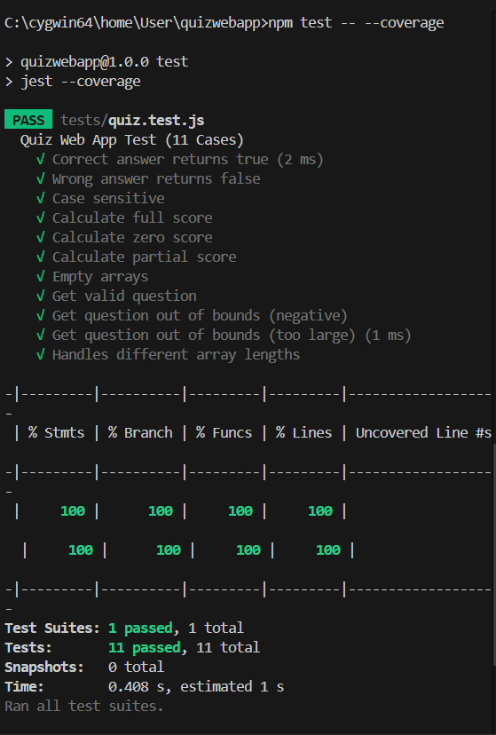
แสดงให้เห็นว่า:
ไม่มีส่วนของโค้ดที่ไม่ได้รับการทดสอบ (No dead code)
ลดความเสี่ยงของ bug ใน logic หลักของระบบ
รองรับการพัฒนาใน Phase ถัดไปได้ง่าย

---

## 19. สิ่งที่ยังไม่เสร็จสมบูรณ์
* **Frontend:** โครงสร้างเว็บและ UI/UX เสร็จสมบูรณ์ พร้อมแสดงฟังก์ชันและฟีเจอร์หลักทั้งหมด

* **Backend:** อยู่ระหว่างการพัฒนาส่วนระบบหลังบ้าน การจัดการฐานข้อมูล และการเชื่อมต่อ API (Data Integration) เพื่อให้ระบบทำงานได้อย่างเต็มรูปแบบ

---

## 20. Website screenshot
- หน้า index
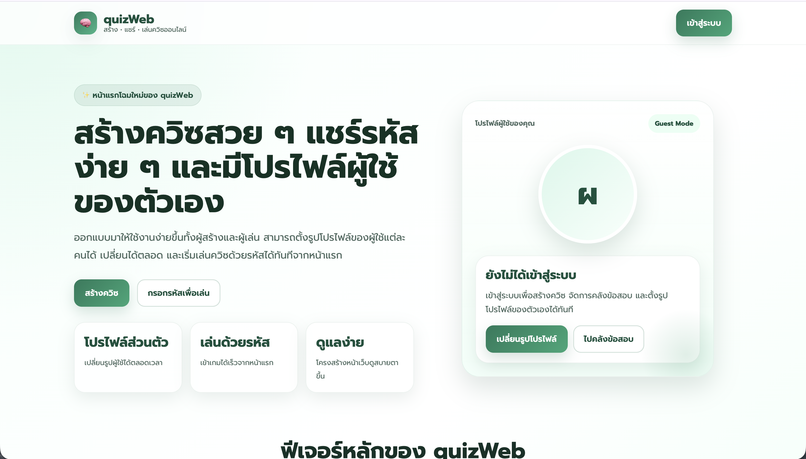
- หน้า index(ต่อ)
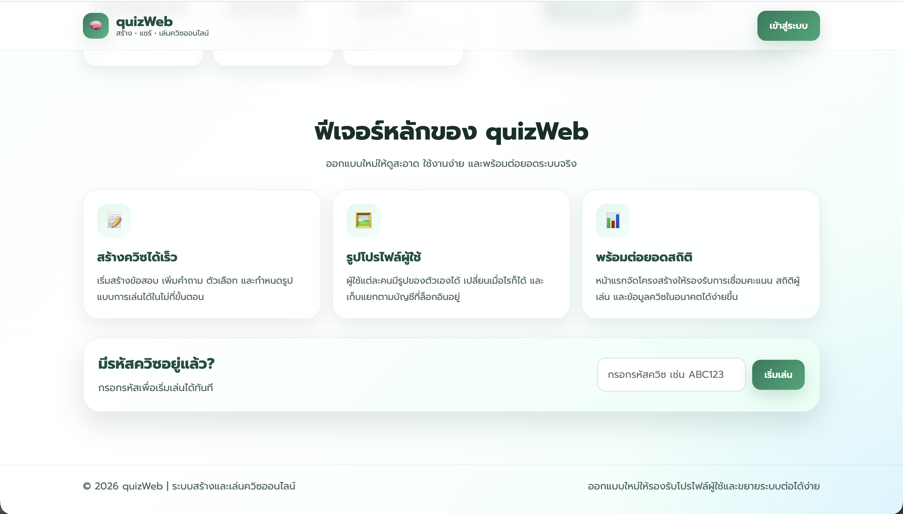

- หน้า login
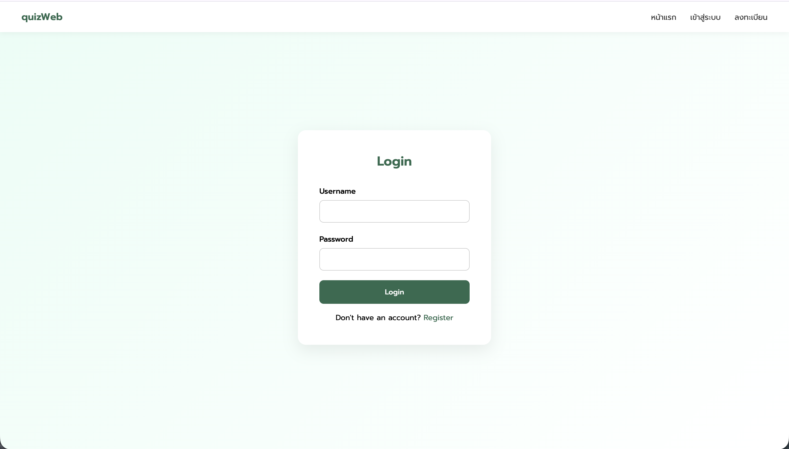

- หน้า register
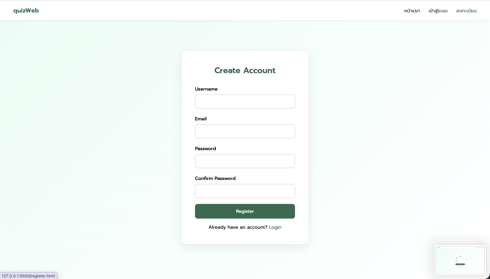

- หน้า dashboard
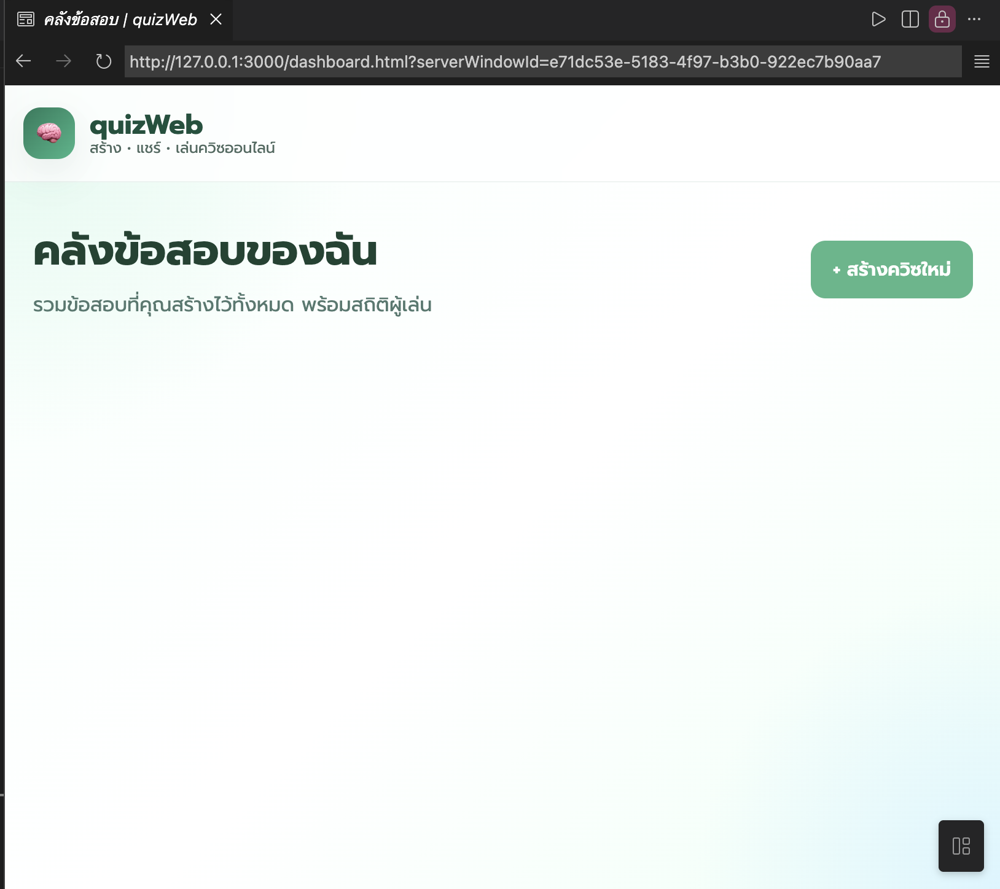

- หน้า join quiz
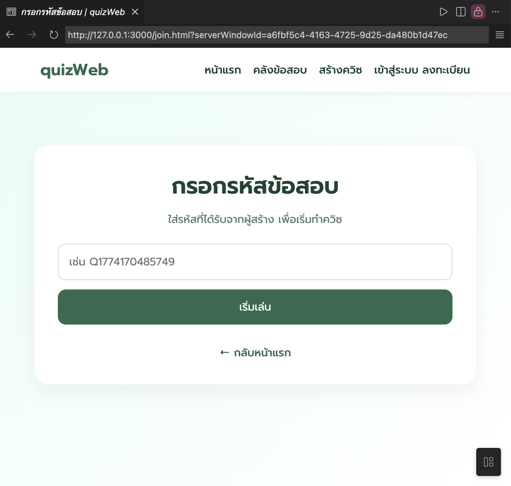

- หน้า create quiz
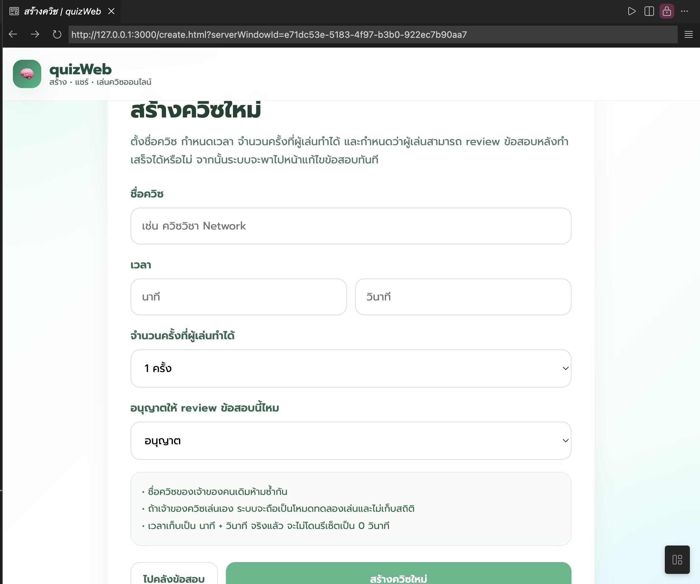

- หน้า edit quiz
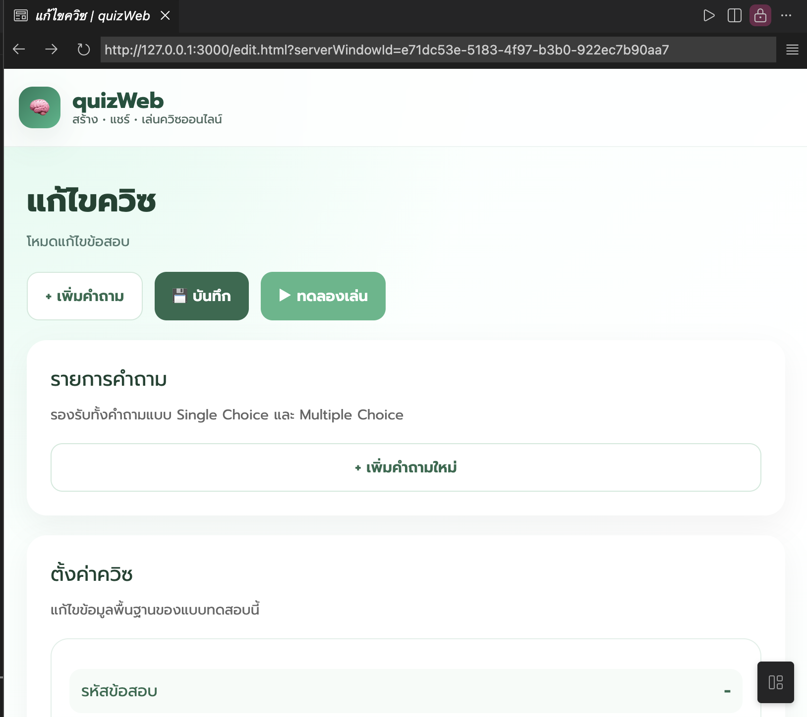
- หน้า edit(ต่อ 1)
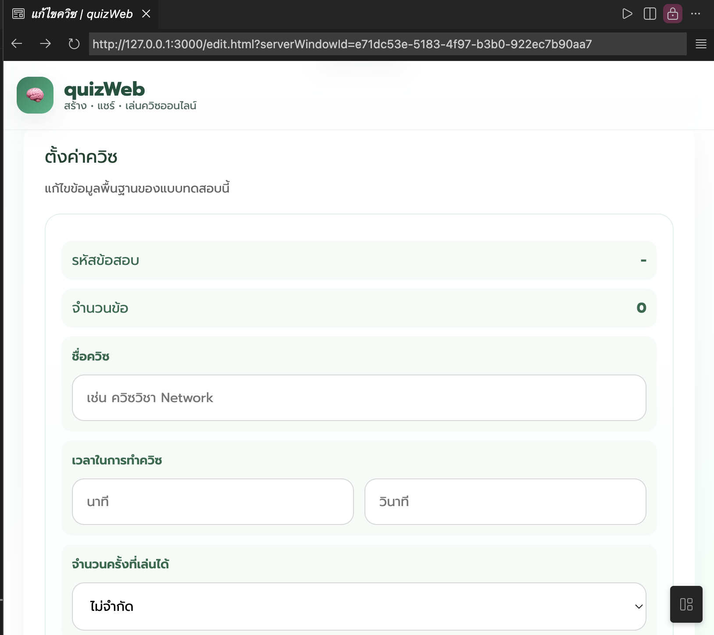
- หน้า edit(ต่อ 2)
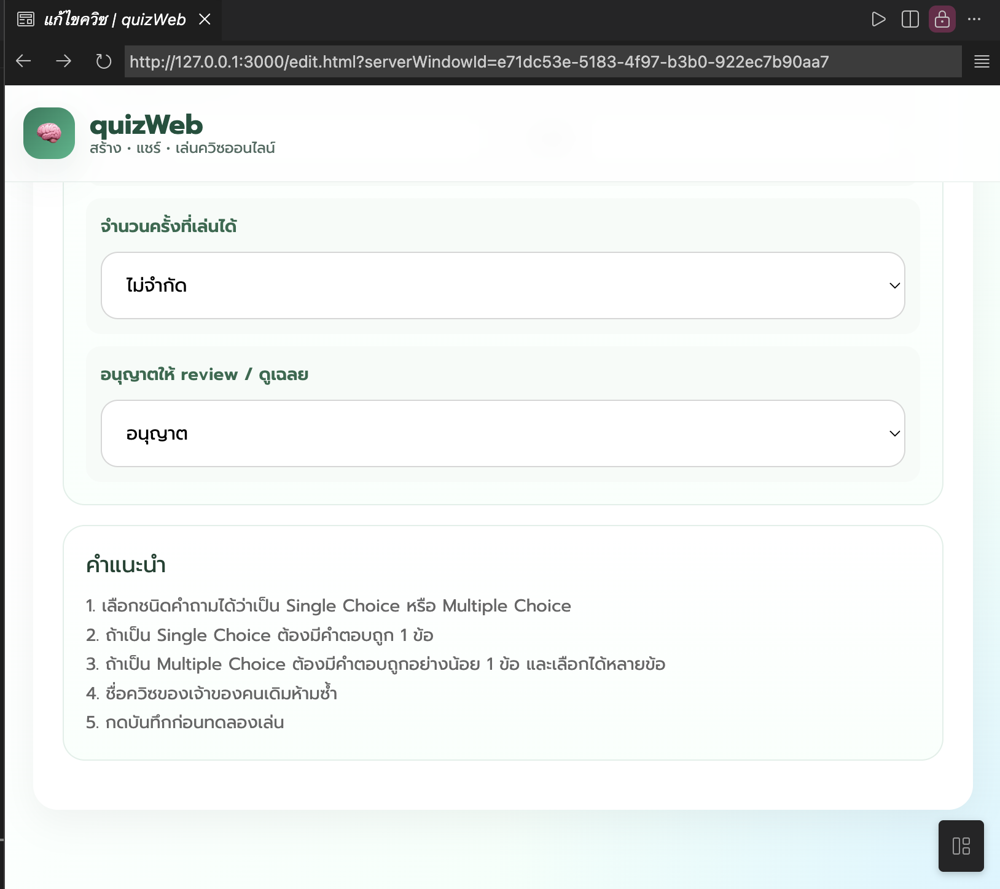

- หน้า play quiz
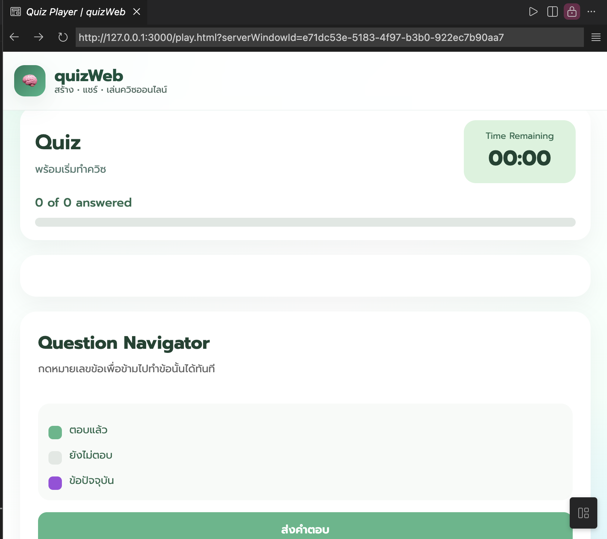

- หน้า admin
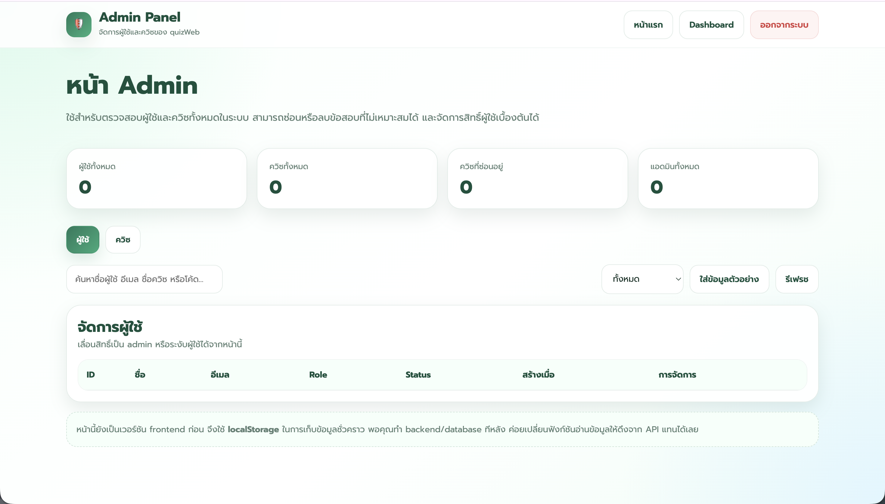

---

## 21. สิ่งเปลี่ยนแปลงจาก รายงาน phase 1 and 2 และ เหดุผลที่เปลี่ยน
**มีการพัฒนาจากแผนงานสู่การปฏิบัติจริง :**

* **การพัฒนา:** เปลี่ยนจากโครงร่างไอเดียและดีไซน์ใน Figma (Phase 1-2) มาเป็นการ เขียน Code จริง จนตัวเว็บเริ่มเป็นรูปเป็นร่างตามที่ออกแบบไว้
* **ฟังก์ชัน & คุณภาพ:** นำฟังก์ชันที่เคยร่างไว้มาทำให้ใช้งานได้จริง (Functional) แม้จะยังไม่สมบูรณ์ 100% แต่มีการเพิ่ม Test Case เข้ามาช่วยตรวจสอบความถูกต้องควบคู่ไปด้วย
* **การบริหารจัดการ:** ปรับปรุงกระบวนการทำงานในทีมให้มีระเบียบมากขึ้น แบ่งหน้าที่ชัดเจนว่าใครรับผิดชอบส่วนไหน และวางแผนการพัฒนาในลำดับถัดไปอย่างเป็นระบบ
* **เหตุผลที่เปลี่ยน:** เพื่อเปลี่ยนจาก "แนวคิด" ให้กลายเป็น "ซอฟต์แวร์ที่ใช้งานได้" โดยเน้นความสำคัญที่โครงสร้างระบบ การทดสอบ และการทำงานร่วมกันอย่างมืออาชีพ

---

## 22. อธิบายกระบวนการทำงาน โดยใช้ process, methods, and tools ที่เพิ่มเติมจาก phase 1 and 2 เช่น การบริหาร project, การ monitor build, การจัดการ bugs  
* **การจัดการคุณภาพโค้ดและ Bugs**
  - Automated Unit Testing: มีการใช้ชุดทดสอบ (Test Cases) จำนวน 11 กรณี ผ่านไฟล์ quiz.test.js เพื่อตรวจสอบความถูกต้องของ Logic ก่อนนำไปใช้งานจริง ซึ่งช่วยดักจับ Bug ในส่วนการคำนวณคะแนนและการดึงข้อมูลคำถาม

* **กระบวนการพัฒนา**
  - จัดระเบียบโค้ดโดยใช้ระบบ module.exports เพื่อแยกส่วน Logic (quiz.js) ออกจากส่วนทดสอบ (quiz.test.js)

* **เครื่องมือที่ใช้**
  - Jest / Istanbul: ใช้สำหรับรันชุดทดสอบและสร้างรายงานผลการทดสอบ
  - VS Code Search & Monitor: ใช้ฟีเจอร์การค้นหาและตรวจสอบสถานะไฟล์ เพื่อติดตามการเปลี่ยนแปลงของไฟล์ README.md และโค้ดในโปรเจกต์

---

## 23. สรุปการประชุม Retrospective Phase 3

ทีมงานได้มีการจัดประชุม Retrospective หลังการดำเนินงานในช่วงการออกแบบและวางโครงสร้าง โดยมีข้อสรุปดังนี้

* **สิ่งที่ทำได้ดี:** ส่วนของการพัฒนา frontend จนเห็นรูปแบบฟังก์ชันและ UI/UX ที่พร้อมใช้งาน มีการแบ่งหน้าที่รับผิดชอบที่ชัดเจนและสื่อสารกันได้ดีขึ้น และทีมมีความเชี่ยวชาญในการใช้ Git ผ่าน Terminal หรือ command ได้ดียิ่งขึ้นจากเฟสก่อนๆ
* **สิ่งที่ควรปรับปรุง:** การจัดการเวลาในการทำ ทำให้การเชื่อมโยงข้อมูลและการจัดเก็บข้อมูลในส่วน Backend ยังทำได้ไม่ครบถ้วนตามแผน
* **แนวทางการพัฒนาในอนาคต:** มุ่งเน้นการพัฒนาส่วนหลังบ้านและระบบฐานข้อมูลให้สมบูรณ์ และนำฟีเจอร์ที่วางโครงร่างไว้มาเชื่อมต่อกับ API เพื่อให้ตัวเว็บทำงานได้จริง

ลิงก์วิดีโอ Retrospective : https://youtu.be/iHDMbaRjDIQ?si=-huqMsOPw68BX2do

---
## 24. Website screenshot
- หน้า index

- หน้า index & join

- หน้า login

- หน้า register

- หน้า dashboard

- หน้า create quiz

- หน้า edit quiz

- หน้า play quiz

- หน้า play quiz สรุปผลหลังเล่น

- หน้า admin (จัดการ user)

- หน้า admin (จัดการ quiz)

## 25. สร้าง 5 UI testcases.
(เช็คให้แน่ใจว่า testcases โดยที่ทุก testcase ต้องมี การเช็คค่าสำหรับ expected results)

# TC-UI-01: Login — validate empty username / password
describe('TC-UI-01: Login Form Validation — กรอกข้อมูลว่างเปล่า', () => {

  test('[Expected] error = "กรุณากรอก Username และ Password" เมื่อทั้งสองช่องว่าง', () => {
    const result = validateLoginForm('', '');

    expect(result.ok).toBe(false);
    expect(result.error).toBe('กรุณากรอก Username และ Password');
  });

  test('[Expected] error = "กรุณากรอก..." เมื่อกรอกเฉพาะ username แต่ password ว่าง', () => {
    const result = validateLoginForm('testuser', '');

    expect(result.ok).toBe(false);
    expect(result.error).toBe('กรุณากรอก Username และ Password');
  });

  test('[Expected] ok = true และ error ว่าง เมื่อกรอกครบทั้งสองช่อง', () => {
    const result = validateLoginForm('testuser', 'Pass1234');

    expect(result.ok).toBe(true);
    expect(result.error).toBe('');
  });

});

# TC-UI-02: Register — validate password mismatch
describe('TC-UI-02: Register Form Validation — รหัสผ่านไม่ตรงกัน', () => {

  test('[Expected] field = "confirmError", error = "Confirm Password ไม่ตรงกัน"', () => {
    const result = validateRegisterForm({
      username:        'newuser',
      password:        'Password1',
      confirmPassword: 'WrongPass1',
    });

    expect(result.ok).toBe(false);
    expect(result.field).toBe('confirmError');
    expect(result.error).toBe('Confirm Password ไม่ตรงกัน');
  });

  test('[Expected] field = "passError" เมื่อ password ไม่ผ่าน pattern (ขาด A-Z)', () => {
    const result = validateRegisterForm({
      username:        'newuser',
      password:        'password1',   // ← ไม่มีตัวพิมพ์ใหญ่
      confirmPassword: 'password1',
    });

    expect(result.ok).toBe(false);
    expect(result.field).toBe('passError');
    expect(result.error).toBe('Password ต้องมี A-Z, a-z และตัวเลข อย่างน้อย 8 ตัว');
  });

  test('[Expected] ok = true เมื่อข้อมูลครบถ้วนและ password ตรงกัน', () => {
    const result = validateRegisterForm({
      username:        'newuser',
      password:        'Password1',
      confirmPassword: 'Password1',
    });

    expect(result.ok).toBe(true);
    expect(result.error).toBe('');
  });

});

# TC-UI-03: Join Quiz — กรอกรหัสว่างเปล่า

describe('TC-UI-03: Join Quiz — กรอกรหัสว่างเปล่า', () => {
  let storage;

  beforeEach(() => {
    storage = createMockStorage({ myQuizzes: [] });
  });

  test('[Expected] error = "กรุณากรอกรหัสข้อสอบ" เมื่อ code เป็น empty string', () => {
    const result = validateJoinCode('', storage);

    expect(result.ok).toBe(false);
    expect(result.error).toBe('กรุณากรอกรหัสข้อสอบ');
  });

  test('[Expected] error = "กรุณากรอกรหัสข้อสอบ" เมื่อ code เป็น null', () => {
    const result = validateJoinCode(null, storage);

    expect(result.ok).toBe(false);
    expect(result.error).toBe('กรุณากรอกรหัสข้อสอบ');
  });

  test('[Expected] error = "กรุณากรอกรหัสข้อสอบ" เมื่อ code เป็น whitespace', () => {
    const result = validateJoinCode('   ', storage);

    expect(result.ok).toBe(false);
    expect(result.error).toBe('กรุณากรอกรหัสข้อสอบ');
  });

});

#  TC-UI-04: Join Quiz — กรอกรหัสที่ไม่มีในระบบ

describe('TC-UI-04: Join Quiz — กรอกรหัสผิดหรือหมดอายุ', () => {
  let storage;

  beforeEach(() => {
    // mock storage: มี quiz หนึ่งรายการในระบบ
    storage = createMockStorage({
      myQuizzes: [
        {
          code:      'Q1234567890',
          title:     'ทดสอบวิชาคณิตศาสตร์',
          questions: [{ text: 'ข้อที่ 1', options: ['A','B','C','D'], correctAnswers: [0] }],
        },
      ],
    });
  });

  test('[Expected] error = "ไม่พบรหัสข้อสอบนี้" เมื่อกรอก code ที่ไม่มีในระบบ', () => {
    const result = validateJoinCode('XXXXXX', storage);

    expect(result.ok).toBe(false);
    expect(result.error).toBe('ไม่พบรหัสข้อสอบนี้');
  });

  test('[Expected] ok = true และได้ quiz object คืนมา เมื่อกรอก code ถูกต้อง', () => {
    const result = validateJoinCode('Q1234567890', storage);

    expect(result.ok).toBe(true);
    expect(result.error).toBe('');
    expect(result.quiz).toBeDefined();
    expect(result.quiz.title).toBe('ทดสอบวิชาคณิตศาสตร์');
  });

  test('[Expected] error = "ข้อสอบนี้ยังไม่มีคำถาม" เมื่อ quiz ไม่มี questions', () => {
    // เพิ่ม quiz ที่ไม่มีคำถาม
    const quizzes = JSON.parse(storage.getItem('myQuizzes'));
    quizzes.push({ code: 'Q_EMPTY', title: 'ว่างเปล่า', questions: [] });
    storage.setItem('myQuizzes', JSON.stringify(quizzes));

    const result = validateJoinCode('Q_EMPTY', storage);

    expect(result.ok).toBe(false);
    expect(result.error).toBe('ข้อสอบนี้ยังไม่มีคำถาม');
  });

});

#  TC-UI-05: Play Quiz — select answer → update UI state

describe('TC-UI-05: Play Quiz — กดเลือกคำตอบแล้ว state ต้องอัปเดต', () => {
  let state;

  beforeEach(() => {
    // จำลอง quiz ที่มี 3 คำถาม
    state = createQuizState(3);
  });

  test('[Expected] isSelected(1) = true หลังจากเลือกตัวเลือก B (index 1)', () => {
    state.selectAnswer(1);  // เลือกตัวเลือก B

    // Expected: ตัวเลือก B ถูกเลือก
    expect(state.isSelected(1)).toBe(true);
  });

  test('[Expected] ตัวเลือกอื่น (A, C, D) isSelected = false หลังเลือก B', () => {
    state.selectAnswer(1);

    // Expected: Single choice — เลือกได้แค่ 1 ข้อ ตัวอื่นต้องไม่ถูกเลือก
    expect(state.isSelected(0)).toBe(false);
    expect(state.isSelected(2)).toBe(false);
    expect(state.isSelected(3)).toBe(false);
  });

  test('[Expected] คำตอบเปลี่ยนได้ → เลือก A แล้วเปลี่ยนเป็น C', () => {
    state.selectAnswer(0);  // เลือก A ก่อน
    expect(state.isSelected(0)).toBe(true);

    state.selectAnswer(2);  // เปลี่ยนใจเลือก C
    // Expected: A ไม่ถูกเลือกแล้ว, C ถูกเลือกแทน
    expect(state.isSelected(0)).toBe(false);
    expect(state.isSelected(2)).toBe(true);
  });

  test('[Expected] progressText = "1 of 3 answered" หลังตอบข้อแรก', () => {
    state.selectAnswer(0);

    // Expected: progress bar text แสดงจำนวนที่ตอบแล้วถูกต้อง
    expect(state.progressText()).toBe('1 of 3 answered');
  });

  test('[Expected] progressPercent = 100 เมื่อตอบครบทุกข้อ', () => {
    state.selectAnswer(0);  // ข้อ 1
    state.next();
    state.selectAnswer(1);  // ข้อ 2
    state.next();
    state.selectAnswer(2);  // ข้อ 3

    // Expected: progress เต็ม 100%
    expect(state.progressPercent()).toBe(100);
    expect(state.answeredCount()).toBe(3);
  });

});

## 26. ผล profiling (Static profiling และ Dynamic profiling) เทียบกับ phase 3

* Static Profiling :
- Phase 3: โค้ดส่วนใหญ่เป็น Hard-coded data และ Array ธรรมดา ความซับซ้อนต่ำแต่จัดการยาก

- Phase 4: เปลี่ยนมาใช้ Asynchronous Programming (async/await) ในการดึงข้อมูลจาก Supabase ทำให้โครงสร้างโค้ดมีความเป็นระเบียบแบบ Model-Controller มากขึ้น ลดความซ้ำซ้อนของโค้ด (Code Duplication) ด้วยการทำ Middleware สำหรับตรวจสอบ Session

* Dynamic Profiling :

- Memory Usage: การใช้ Supabase ช่วยลดภาระการเก็บข้อมูลใน Memory (RAM) ของ Server เพราะข้อมูลไปฝากไว้ที่ Cloud แทนการใช้ Local Variable

- Response Time: อาจมีหน่วงเพิ่มขึ้นเล็กน้อย (ประมาณ 100-200ms) เนื่องจากการเรียก API ไปยัง Supabase แต่แลกมาด้วยความเสถียรของข้อมูลที่มากกว่า SQLite ใน Phase ก่อน

## 27. อธิบายการทำ CI/CD ที่ใช้ในการทำ product โดยที่ CI (Pipeline) ให้ใช้ script ที่มีให้ (จำเป็นต้องมี free tier parallel job) 

* **CI (Continuous Integration)** ด้วย GitHub Actions:

- Pipeline Script: ใช้ main.yml ในการกำหนดขั้นตอนการทำงานอัตโนมัติ ทุกครั้งที่มีการ push โค้ดขึ้นไป ระบบจะทำการสร้างสภาพแวดล้อมจำลอง  และรันคำสั่งตาม Script ที่เขียนไว้

- กระบวนการ: เริ่มจาก npm install เพื่อติดตั้ง Library จากนั้นรัน npm test เพื่อตรวจสอบความถูกต้องของโค้ด เช่น Logic ของ Quiz และ UI

- Free Tier Parallel Job: ใช้ GitHub Actions ซึ่งให้โควตาใช้งานฟรีสำหรับ Public Repository โดยระบบสามารถรัน Job หลายตัวขนานกันได้ ทำให้การตรวจโค้ดทำได้รวดเร็ว

* **CD (Continuous Deployment)** ด้วย Render:

- เมื่อ CI ผ่านเครื่องหมายถูกสีเขียวแล้ว ระบบจะทำการส่งสัญญาณไปยัง Render เพื่อให้ทำการ "Deploy" อัตโนมัติ โดยการดึงโค้ดล่าสุดไปอัปเดตบน Server จริงทันที ทำให้ผู้ใช้เห็นฟีเจอร์ใหม่ ได้แบบ Real-time

## 28. อธิบายกระบวนการทำงาน โดยใช้ process, methods, and tools ที่เพิ่มเติมจาก phase 1,2 and 3 เช่น การบริหาร project, การ monitor build, การจัดการ bugs  
ใน Phase 4 นี้ทีมได้ยกระดับการทำงานให้มีความเป็นมืออาชีพมากขึ้น โดยใช้เครื่องมือและวิธีการดังนี้:
* การบริหาร Project
  - ใช้ .gitignore อย่างเป็นระบบเพื่อแยก Source Code ออกจาก Dependency (node_modules) และความลับของระบบ (.env) ทำให้ Repository เบาและปลอดภัย
  - มีการใช้ Branch Management และการ Merge งานเพื่อรวมฟีเจอร์จากสมาชิกหลายคนเข้าด้วยกันอย่างเป็นระบบ

* การ Monitor Build
  - เฝ้าติดตามสถานะการ Build ผ่าน GitHub Actions Tab เพื่อดู Log การทำงานแบบ Real-time ทำให้รู้ได้ทันทีว่า Code พังที่ขั้นตอนไหน

* การจัดการ Bugs
  - เปลี่ยนจากการ Manual Test มาเป็นการใช้ Automated Testing
  - ใช้ Jest เป็น Testing Framework หลักในการรันข้อสอบอัตโนมัติ และใช้ Render ในการทำ Automatic Deployment

## 29. Final Retrospective 

สิ่งที่ทำได้ดี
- ทีมสามารถพัฒนา Backend และเชื่อมต่อกับฐานข้อมูล Supabase ได้สำเร็จ ทำให้ระบบสามารถทำงานได้จริงครบตามฟีเจอร์หลักที่วางไว้ เช่น การทำข้อสอบ การคำนวณคะแนน และการแสดงผลสถิติ
- มีการปรับโครงสร้างโค้ดให้รองรับ async/await และแยกเป็น module ช่วยให้โค้ดมีความเป็นระเบียบและง่ายต่อการพัฒนา
- ทีมมีการสื่อสารและทำงานร่วมกันได้ดี ใช้ GitHub ในการติดตามงานและจัดการเวอร์ชันอย่างต่อเนื่อง

สิ่งที่ควรปรับปรุง
- ระบบยังสามารถพัฒนาเพิ่มเติมได้ในด้านประสิทธิภาพ เช่น การลดเวลาในการตอบสนองจากการเรียก API
- การจัดการ Error ยังไม่ครอบคลุมทุกกรณี และการทดสอบในบางส่วนยังไม่ครบถ้วนในระดับ Integration

แนวทางการพัฒนาในอนาคต
- ปรับปรุงประสิทธิภาพของระบบเพื่อลด Response Time
- เพิ่มการจัดการ Error Handling ให้ครอบคลุมมากขึ้น
- เพิ่มการทดสอบแบบ Integration และ End-to-End
- พัฒนาการแสดงผลข้อมูล เช่น การใช้กราฟหรือ Visualization เพื่อให้เข้าใจง่ายขึ้น

Link to Retrospective Youtube video: https://youtu.be/4ytSqzFSh8k

