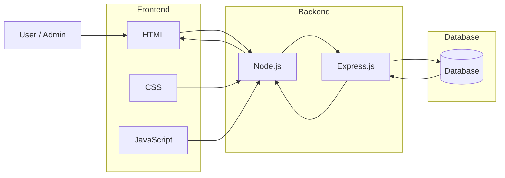
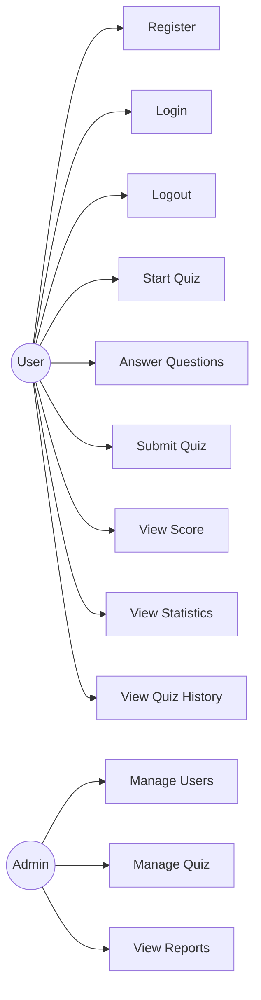

# เอกสารขอบเขตงาน (Terms of Reference: TOR)

## โครงการพัฒนาเว็บทำข้อสอบออนไลน์ (quizWeb)

---

## 1. ข้อมูลทั่วไปของโครงการ

ชื่อโครงการ: โครงการพัฒนาเว็บทำข้อสอบออนไลน์ (quizWeb)
ลักษณะโครงการ: โครงการพัฒนาเว็บเพื่อการศึกษา
เทคโนโลยีหลัก: Node.js และ Web-based Application

---

## 2. รายชื่อสมาชิกกลุ่ม

1. นางสาวแพรวปภัสสร ว่องธนากิจ 67102010524
2. นางสาวภัทรธิดา จารุจิตจำเริญ 67102010525
3. นางสาวศรุชา วิริยะจิตต์ 67102010531

---

## 3. ที่มาและความสำคัญของโครงการ

ในปัจจุบัน การเรียนการสอนออนไลน์มีบทบาทสำคัญอย่างยิ่ง โดยเฉพาะระบบการทำข้อสอบออนไลน์ที่ถูกนำมาใช้อย่างแพร่หลาย อย่างไรก็ตาม ระบบทำข้อสอบจำนวนมากยังขาดการแสดงผลการวิเคราะห์คะแนนและสถิติที่ชัดเจน เช่น คะแนนเฉลี่ย คะแนนสูงสุด และคะแนนต่ำสุด ส่งผลให้ผู้เรียนไม่สามารถประเมินผลการเรียนรู้ของตนเองได้อย่างมีประสิทธิภาพ

ดังนั้น โครงการ quizWeb จึงมีวัตถุประสงค์เพื่อพัฒนาเว็บทำข้อสอบออนไลน์ที่สามารถตรวจคำตอบ คำนวณคะแนน และวิเคราะห์ผลคะแนนในรูปแบบสถิติได้โดยอัตโนมัติ เพื่อเพิ่มประสิทธิภาพในการเรียนรู้ของผู้เรียนและลดภาระงานของผู้สอน

---

## 4. วัตถุประสงค์ของโครงการ

### 4.1 วัตถุประสงค์หลัก

* เพื่อพัฒนาเว็บทำข้อสอบออนไลน์โดยใช้ Node.js
* เพื่อสร้างระบบตรวจคำตอบและคำนวณคะแนนอัตโนมัติ
* เพื่อแสดงผลการวิเคราะห์คะแนนสอบในรูปแบบสถิติ

### 4.2 ประโยชน์ที่คาดว่าจะได้รับ

* ผู้เรียนสามารถประเมินผลการเรียนรู้ของตนเองได้อย่างชัดเจน
* ช่วยลดภาระในการตรวจข้อสอบของผู้สอน
* ผู้พัฒนาได้ฝึกทักษะการทำงานเป็นทีม การพัฒนาเว็บ และการใช้งาน GitHub

---

## 5. ขอบเขตของงาน (Scope of Work)

### 5.1 ขอบเขตงานที่ดำเนินการ (In Scope)

* ระบบทำข้อสอบแบบปรนัย (Multiple Choice)
* ระบบตรวจคำตอบอัตโนมัติ
* ระบบคำนวณและแสดงคะแนนสอบ
* ระบบแสดงสถิติพื้นฐาน ได้แก่ คะแนนเฉลี่ย (Average), คะแนนสูงสุด (Max) และคะแนนต่ำสุด (Min)
* ระบบสมัครสมาชิก เข้าสู่ระบบ และออกจากระบบ
* ระบบจัดการควิซและคำถาม

### 5.2 ขอบเขตงานที่ไม่ดำเนินการ (Out of Scope)

* ระบบชำระเงิน
* ระบบสมัครสมาชิกขั้นสูง
* ระบบสอบที่มีความซับซ้อน เช่น การสอบอัตนัย หรือการจับเวลาแบบพิเศษ

---

## 6. ความต้องการของระบบ (System Requirements)

### 6.1 Functional Requirements

* ระบบต้องให้ผู้ใช้สมัครสมาชิก เข้าสู่ระบบ และออกจากระบบได้
* ระบบต้องให้ผู้ใช้สร้าง แก้ไข และลบคำถามในควิซได้
* ระบบต้องให้ผู้ใช้ตั้งค่าควิซ บันทึกแบบร่าง และเผยแพร่ควิซได้
* ระบบต้องแสดงรายการควิซและให้ผู้ใช้เริ่มทำควิซได้
* ระบบต้องแสดงเวลาที่เหลือระหว่างทำควิซ และส่งคำตอบอัตโนมัติเมื่อหมดเวลา
* ระบบต้องคำนวณและแสดงคะแนนหลังจากผู้ใช้ส่งควิซ
* ระบบต้องแสดงประวัติการสร้างควิซและประวัติการทำควิซของผู้ใช้
* ระบบต้องให้ผู้ดูแลระบบสามารถจัดการผู้ใช้ ควิซ และดูรายงานของระบบได้

### 6.2 Non-Functional Requirements

* ระบบต้องมีความปลอดภัย โดยมีการยืนยันตัวตนและกำหนดสิทธิ์การใช้งาน
* ระบบต้องใช้งานง่ายและแสดงข้อมูลสำคัญอย่างชัดเจน
* ระบบต้องตอบสนองรวดเร็วและรองรับผู้ใช้งานหลายคนพร้อมกัน
* ระบบต้องมีความน่าเชื่อถือและไม่สูญหายของข้อมูล
* ระบบต้องสามารถขยายและปรับปรุงฟีเจอร์ในอนาคตได้

---

## 7. โครงสร้างข้อมูลที่ใช้ในระบบ (Data Structure)

* **Question**: ใช้เก็บข้อมูลคำถาม ตัวเลือกคำตอบ และคำตอบที่ถูกต้อง
* **Quiz**: ใช้เก็บข้อมูลชุดข้อสอบที่ประกอบด้วยคำถามหลายข้อ
* **Result**: ใช้เก็บข้อมูลผลลัพธ์การทำข้อสอบ เช่น คะแนน และสถิติของผู้ใช้

โครงสร้างข้อมูลดังกล่าวถูกนำมาใช้ในการตรวจคำตอบ การคำนวณคะแนน และการแสดงผลสถิติ

---

## 8. Use Case ของระบบ

**Actor หลัก:** ผู้ใช้ (User)

**Use Case หลัก:**

* เริ่มทำข้อสอบ
* ตอบคำถามในข้อสอบ
* ส่งคำตอบ
* ดูคะแนนสอบ
* ดูสถิติผลคะแนน (Average, Max, Min)

---

## 9. กระบวนการพัฒนาและเครื่องมือที่ใช้

* ใช้กระบวนการพัฒนาแบบ Agile
* ใช้ GitHub Repository สำหรับควบคุมเวอร์ชันและทำงานร่วมกันภายในทีม
* ใช้ Web Browser เป็นช่องทางหลักในการเข้าถึงระบบ
* พัฒนา Frontend หน้าเว็บไซต์
   - CSS, HTML, JavaScript (VS Code)
* พัฒนา Backend
   - JavaScript (Node.js)
   - Framework (Express.js)
  ใช้รับคำขอจากผู้ใช้, ตรวจคำตอบ, คำนวณคะแนน, ส่งผลคะแนนกลับไป
* พัฒนา Database
   - 
* ใช้ Web Browser เป็นช่องทางหลักในการเข้าถึงระบบ

---

## 10. สรุปขั้นตอนการจัดทำ Requirement

การจัดทำ Requirement ของโครงการเริ่มจากการสัมภาษณ์ผู้ใช้งานกลุ่มเป้าหมาย เพื่อรวบรวมความต้องการของระบบ จากนั้นนำข้อมูลมาวิเคราะห์และจัดทำเป็น Functional และ Non-Functional Requirements รวมถึงกำหนดขอบเขตของโครงการให้ชัดเจน โดยมีการบันทึกขั้นตอนดังกล่าวเป็นวิดีโอประกอบ

ลิงก์วิดีโอการสัมภาษณ์: https://youtu.be/3tyhzvMVRvY

---

## 11. สรุปผลการประชุม Retrospective Phase 1

ทีมงานได้มีการจัดประชุม Retrospective หลังการดำเนินงานในแต่ละช่วง โดยมีข้อสรุปดังนี้

* **สิ่งที่ทำได้ดี:** การสื่อสารภายในทีมและการแบ่งหน้าที่ชัดเจน
* **สิ่งที่ควรปรับปรุง:** การวางแผนเวลาในการพัฒนาให้รัดกุมมากขึ้น
* **แนวทางการพัฒนาในอนาคต:** ปรับปรุงกระบวนการทำงานให้มีประสิทธิภาพและลดปัญหาที่อาจเกิดขึ้นซ้ำ

ลิงก์วิดีโอ Retrospective: https://youtu.be/8sUTdzBlkeQ?si=CepGhHKbjgSgSOSg

---

## 12. Design Document

### 12.1 Architectural Design

```mermaid
flowchart LR

User[User / Admin]

subgraph Frontend
    A[HTML]
    B[CSS]
    C[JavaScript]
end

subgraph Backend
    D[Node.js]
    E[Express.js]
end

subgraph Database
    F[(Database)]
end

User --> A
A --> D
B --> D
C --> D
D --> E
E --> F
F --> E
E --> D
D --> A
```

### 12.2 Use Case Diagram

```mermaid
flowchart LR

User((User))
Admin((Admin))

User --> Register[Register]
User --> Login[Login]
User --> Logout[Logout]

User --> StartQuiz[Start Quiz]
User --> Answer[Answer Questions]
User --> Submit[Submit Quiz]

User --> ViewScore[View Score]
User --> ViewStats[View Statistics]
User --> History[View Quiz History]

Admin --> ManageUsers[Manage Users]
Admin --> ManageQuiz[Manage Quiz]
Admin --> ViewReports[View Reports]
```
---

## 13. Figma screenshot

หน้า index ที่ยังไม่ได้ login:

หน้า index:

หน้า login:

หน้า sign in:

หน้า create_quiz:

หน้า dashboard:

หน้า history:

หน้า about:

หน้า quiz test:

---

## 14. กระบวนการทำงาน (Process, Methods, and Tools)

### 14.1 กระบวนการพัฒนา (Process)
ทีมใช้แนวทาง Agile Development โดยแบ่งการทำงานออกเป็นช่วงสั้น ๆ (Iteration) และมีการประชุมติดตามงานอย่างสม่ำเสมอ

🔹 การแบ่งงาน
แบ่งงานตาม Feature
แยก Frontend และ Backend
กำหนดผู้รับผิดชอบชัดเจน

### 14.2 การติดตามสถานะโครงการ (Project Tracking)
✅ วิธีการ
ใช้ GitHub Projects / Issues ในการติดตามงาน
แบ่งสถานะงานเป็น:
To Do
In Progress
Done

✅ เครื่องมือที่ใช้
GitHub Repository
GitHub Issues
GitHub Projects Board

### 14.3 ความถี่ของ Scrum Meeting
ประชุมสั้น (Scrum) สัปดาห์ละ 2 ครั้ง
แต่ละครั้งใช้เวลาประมาณ 15–30 นาที

เนื้อหาที่พูดคุย:
ทำอะไรเสร็จแล้ว
กำลังทำอะไร
มีปัญหาอะไรหรือไม่

### 14.4 การสื่อสารภายในทีม
วิธีการสื่อสาร:
พูดคุยผ่านกลุ่ม Line
นัดประชุมออนไลน์
ใช้ GitHub comment ใน Pull Request

เครื่องมือที่ใช้:
GitHub
Line
Visual Studio Code

---

## 15. สรุปการประชุม Retrospective Phase 2
ทีมงานได้มีการจัดประชุม Retrospective หลังการดำเนินงานในช่วงการออกแบบและวางโครงสร้าง โดยมีข้อสรุปดังนี้

* **สิ่งที่ทำได้ดี:** การถ่ายทอดแนวคิดจาก Phase 1 ออกมาเป็นรูปธรรมผ่านการออกแบบ UI ใน Figma และการวางโครงสร้างระบบ (Architectural Design/Use Case) ที่ชัดเจน
* **สิ่งที่ควรปรับปรุง:** รายละเอียดในดีไซน์บางส่วนยังมีความซับซ้อนเกินไปเมื่อต้องนำมาแปลงเป็นโค้ดจริง และการประสานงานระหว่างฝ่ายออกแบบกับฝ่ายพัฒนาที่ต้องปรับจูนให้ตรงกัน
* **แนวทางการพัฒนาในอนาคต:** มุ่งเน้นการเปลี่ยนจากโครงร่างงานออกแบบไปสู่การเขียนโค้ดอย่างจริงจัง โดยเริ่มทำ Test Case ควบคู่ไปกับการพัฒนาเพื่อลดข้อผิดพลาด (Bug) ที่อาจเกิดขึ้น

ลิงก์วิดีโอ Retrospective : https://youtu.be/j3Xpjw5YBVo?si=r-ShhXsesSQTKDc1

---

## 16. ข้อมูลเดิมจาก phase 1 and 2
* Phase 1: วางแนวคิดสิ่งที่อยากทำ กำหนดขอบเขต รวบรวมฟีเจอร์ วางลำดับการใช้งานของผู้ใช้

* Phase 2: ออกแบบหน้าตาเว็บ จัดวางตำแหน่งปุ่มและเนื้อหา ทำตัวต้นแบบที่กดคลิกเชื่อมโยงหน้าต่างๆ ได้เพื่อให้เห็นภาพของตัวเว็บ

## 17. อธิบายการทำงานของ program (เช่น มี get กี่ method, post กี่ method, ใช้ template อย่างไร, มีการเรียก API หรือไม่อย่างไร, มีการคำนวนอะไร หรือ graph อะไร)

* **ฟังก์ชันหลักและการประมวลผล**
โปรแกรมทำงานผ่าน 3 ฟังก์ชันหลักที่จัดการข้อมูลคำถามและคำตอบ ดังนี้:

  - checkAnswer(user, correct): ทำหน้าที่เปรียบเทียบคำตอบที่ผู้ใช้ส่งมากับเฉลยในรูปแบบ Boolean (true/false)

  - calculateScore(answers, correctAnswers): ใช้ลูป (for loop) ในการตรวจทานชุดคำตอบทั้งหมด โดยจะเพิ่มค่าตัวแปร score ทีละ 1 คะแนน เมื่อคำตอบในตำแหน่งนั้นๆ ตรงกับเฉลย

  - getQuestion(questions, index): ระบบดึงข้อมูลคำถามตามลำดับที่ระบุ โดยมีการตรวจสอบเงื่อนไข (Validation) เพื่อป้องกันข้อผิดพลาดกรณี Index น้อยกว่า 0 หรือเกินจำนวนคำถามที่มีอยู่จริง (จะคืนค่าเป็น null)

  - มีการเรียก API โดยมีการใช้ Google Fonts API ผ่าน Link Tag เพื่อดึงฟอนต์ 'Prompt' มาใช้ในการจัดการหน้าเว็บ

  - ใช้โครงสร้างข้อมูลแบบ Array ในการเก็บชุดคำถามและคำตอบ
  - ใช้ระบบ Module Exports เพื่อรองรับการเรียกใช้ฟังก์ชันข้ามไฟล์และการทำ Testing

---

## 18. Test cases
### 18.1 ตาราง Unit Test Cases (Data Structure)
| TC | Function       | Input                          | Expected Result | Actual Result | Status |
|----|----------------|--------------------------------|-----------------|---------------|--------|
| 1  | calculateScore | ['A','B','C'],['A','B','C']    | 3               | 3             | Pass   |
| 2  | calculateScore | ['A','A','A'],['B','B','B']    | 0               | 0             | Pass   |
| 3  | calculateScore | ['A','B','C'],['A','C','C']    | 2               | 2             | Pass   |
| 4  | calculateScore | [],[]                          | 0               | 0             | Pass   |
| 5  | calculateScore | ['A'],['A','B']                | 1               | 1             | Pass   |
| 6  | getQuestion    | ['Q1','Q2','Q3'],1             | 'Q2'            | 'Q2'          | Pass   |
| 7  | getQuestion    | ['Q1','Q2'],-1                 | null            | null          | Pass   |
| 8  | getQuestion    | ['Q1','Q2'],5                  | null            | null          | Pass   |
| 9  | getQuestion    | [],0                           | null            | null          | Pass   |
| 10 | calculateScore | [null,'B'],['A','B']           | 1               | 1             | Pass   |

### 18.2 ตาราง Unit Test Cases (Function / Class อื่น)
| TC | Function    | Input       | Expected Result | Actual Result | Status |
|----|-------------|-------------|-----------------|---------------|--------|
| 11 | checkAnswer | 'A','A'     | true            | true          | Pass   |
| 12 | checkAnswer | 'A','B'     | false           | false         | Pass   |
| 13 | checkAnswer | 'a','A'     | false           | false         | Pass   |

 ### 18.3 ตัวอย่าง Test Case Code
const {
  checkAnswer,
  calculateScore,
  getQuestion
} = require('../quiz');

describe('Quiz Web App Test (11 Cases)', () => {

  //  1
  test('Correct answer returns true', () => {
    expect(checkAnswer('A', 'A')).toBe(true);
  });

  //  2
  test('Wrong answer returns false', () => {
    expect(checkAnswer('A', 'B')).toBe(false);
  });

  //  3
  test('Case sensitive', () => {
    expect(checkAnswer('a', 'A')).toBe(false);
  });

  //  4
  test('Calculate full score', () => {
    expect(calculateScore(['A','B','C'], ['A','B','C'])).toBe(3);
  });

  //  5
  test('Calculate zero score', () => {
    expect(calculateScore(['A','A','A'], ['B','B','B'])).toBe(0);
  });

  //  6
  test('Calculate partial score', () => {
    expect(calculateScore(['A','B','C'], ['A','C','C'])).toBe(2);
  });

  //  7
  test('Empty arrays', () => {
    expect(calculateScore([], [])).toBe(0);
  });

  //  8
  test('Get valid question', () => {
    const questions = ['Q1','Q2','Q3'];
    expect(getQuestion(questions, 1)).toBe('Q2');
  });

  //  9
  test('Get question out of bounds (negative)', () => {
    const questions = ['Q1','Q2'];
    expect(getQuestion(questions, -1)).toBe(null);
  });

  //  10
  test('Get question out of bounds (too large)', () => {
    const questions = ['Q1','Q2'];
    expect(getQuestion(questions, 5)).toBe(null);
  });

  //  11
  test('Handles different array lengths', () => {
    expect(calculateScore(['A','B'], ['A','B','C'])).toBe(2);
  });

});

### 18.4 Test Coverage Report

แสดงให้เห็นว่า:
ไม่มีส่วนของโค้ดที่ไม่ได้รับการทดสอบ (No dead code)
ลดความเสี่ยงของ bug ใน logic หลักของระบบ
รองรับการพัฒนาใน Phase ถัดไปได้ง่าย

---

## 19. สิ่งที่ยังไม่เสร็จสมบูรณ์
* **Frontend:** โครงสร้างเว็บและ UI/UX เสร็จสมบูรณ์ พร้อมแสดงฟังก์ชันและฟีเจอร์หลักทั้งหมด

* **Backend:** อยู่ระหว่างการพัฒนาส่วนระบบหลังบ้าน การจัดการฐานข้อมูล และการเชื่อมต่อ API (Data Integration) เพื่อให้ระบบทำงานได้อย่างเต็มรูปแบบ

---

## 20. Website screenshot
- หน้า index

- หน้า index(ต่อ)

- หน้า login

- หน้า register

- หน้า dashboard

- หน้า join quiz

- หน้า create quiz

- หน้า edit quiz

- หน้า edit(ต่อ 1)

- หน้า edit(ต่อ 2)

- หน้า play quiz

- หน้า admin

---

## 21. สิ่งเปลี่ยนแปลงจาก รายงาน phase 1 and 2 และ เหดุผลที่เปลี่ยน
**มีการพัฒนาจากแผนงานสู่การปฏิบัติจริง :**

* **การพัฒนา:** เปลี่ยนจากโครงร่างไอเดียและดีไซน์ใน Figma (Phase 1-2) มาเป็นการ เขียน Code จริง จนตัวเว็บเริ่มเป็นรูปเป็นร่างตามที่ออกแบบไว้
* **ฟังก์ชัน & คุณภาพ:** นำฟังก์ชันที่เคยร่างไว้มาทำให้ใช้งานได้จริง (Functional) แม้จะยังไม่สมบูรณ์ 100% แต่มีการเพิ่ม Test Case เข้ามาช่วยตรวจสอบความถูกต้องควบคู่ไปด้วย
* **การบริหารจัดการ:** ปรับปรุงกระบวนการทำงานในทีมให้มีระเบียบมากขึ้น แบ่งหน้าที่ชัดเจนว่าใครรับผิดชอบส่วนไหน และวางแผนการพัฒนาในลำดับถัดไปอย่างเป็นระบบ
* **เหตุผลที่เปลี่ยน:** เพื่อเปลี่ยนจาก "แนวคิด" ให้กลายเป็น "ซอฟต์แวร์ที่ใช้งานได้" โดยเน้นความสำคัญที่โครงสร้างระบบ การทดสอบ และการทำงานร่วมกันอย่างมืออาชีพ

---

## 22. อธิบายกระบวนการทำงาน โดยใช้ process, methods, and tools ที่เพิ่มเติมจาก phase 1 and 2 เช่น การบริหาร project, การ monitor build, การจัดการ bugs  
* **การจัดการคุณภาพโค้ดและ Bugs**
  - Automated Unit Testing: มีการใช้ชุดทดสอบ (Test Cases) จำนวน 11 กรณี ผ่านไฟล์ quiz.test.js เพื่อตรวจสอบความถูกต้องของ Logic ก่อนนำไปใช้งานจริง ซึ่งช่วยดักจับ Bug ในส่วนการคำนวณคะแนนและการดึงข้อมูลคำถาม

* **กระบวนการพัฒนา**
  - จัดระเบียบโค้ดโดยใช้ระบบ module.exports เพื่อแยกส่วน Logic (quiz.js) ออกจากส่วนทดสอบ (quiz.test.js)

* **เครื่องมือที่ใช้**
  - Jest / Istanbul: ใช้สำหรับรันชุดทดสอบและสร้างรายงานผลการทดสอบ
  - VS Code Search & Monitor: ใช้ฟีเจอร์การค้นหาและตรวจสอบสถานะไฟล์ เพื่อติดตามการเปลี่ยนแปลงของไฟล์ README.md และโค้ดในโปรเจกต์

---

## 23. สรุปการประชุม Retrospective Phase 3

ทีมงานได้มีการจัดประชุม Retrospective หลังการดำเนินงานในช่วงการออกแบบและวางโครงสร้าง โดยมีข้อสรุปดังนี้

* **สิ่งที่ทำได้ดี:** ส่วนของการพัฒนา frontend จนเห็นรูปแบบฟังก์ชันและ UI/UX ที่พร้อมใช้งาน มีการแบ่งหน้าที่รับผิดชอบที่ชัดเจนและสื่อสารกันได้ดีขึ้น และทีมมีความเชี่ยวชาญในการใช้ Git ผ่าน Terminal หรือ command ได้ดียิ่งขึ้นจากเฟสก่อนๆ
* **สิ่งที่ควรปรับปรุง:** การจัดการเวลาในการทำ ทำให้การเชื่อมโยงข้อมูลและการจัดเก็บข้อมูลในส่วน Backend ยังทำได้ไม่ครบถ้วนตามแผน
* **แนวทางการพัฒนาในอนาคต:** มุ่งเน้นการพัฒนาส่วนหลังบ้านและระบบฐานข้อมูลให้สมบูรณ์ และนำฟีเจอร์ที่วางโครงร่างไว้มาเชื่อมต่อกับ API เพื่อให้ตัวเว็บทำงานได้จริง

ลิงก์วิดีโอ Retrospective : https://youtu.be/iHDMbaRjDIQ?si=-huqMsOPw68BX2do

---
## 24. Website screenshot

## 25. สร้าง 5 UI testcases.

## 26. เช็คให้แน่ใจว่า testcases โดยที่ทุก testcase ต้องมี การเช็คค่าสำหรับ expected results

## 27. ผล profiling (Static profiling และ Dynamic profiling) เทีบยกับ phase 3

## 28. อธิบายการทำ CI/CD ที่ใช้ในการทำ product โดยที่ CI (Pipeline) ให้ใช้ script ที่มีให้ (จำเป็นต้องมี free tier parallel job) 

## 29. อธิบายกระบวนการทำงาน โดยใช้ process, methods, and tools ที่เพิ่มเติมจาก phase 1,2 and 3 เช่น การบริหาร project, การ monitor build, การจัดการ bugs  

## 30. Final Retrospective 
Link to Retrospective Youtube video: 

Phase 4 :  Final product (5 pt)

Website ที่สมบูรณ์ และไม่ควรมี bug ถ้าไม่เสร็จให้อธิบายเหตุผล คะแนนจะพิจารณาจากเหตุผล
Report ประกอบด้วย (อย่าลืมระบุรายชื่อสมาชิกกลุ่ม)
ข้อมูลเดิมจาก phase 1,2 and 3
Website screenshot
สร้าง 5 UI testcases.
เช็คให้แน่ใจว่า testcases โดยที่ทุก testcase ต้องมี การเช็คค่าสำหรับ expected results
ผล profiling (Static profiling และ Dynamic profiling) เทีบยกับ phase 3
อธิบายการทำ CI/CD ที่ใช้ในการทำ product โดยที่ CI (Pipeline) ให้ใช้ script ที่มีให้ (จำเป็นต้องมี free tier parallel job)   
อธิบายกระบวนการทำงาน โดยใช้ process, methods, and tools ที่เพิ่มเติมจาก phase 1,2 and 3 เช่น การบริหาร project, การ monitor build, การจัดการ bugs  
เขียนสรุปการประชุม Final Retrospective และ Link to Retrospective Youtube video
Onsite presentation (อยากให้ทำ video presentation เป็นการซ้อม และเผื่อให้รุ่นน้องดู แล้วแต่สมัครใจ)
อธิบายกระบวนการทำ project และค่า profiling ด้วย PPT ที่เหลือเปิดเว็บส์อธิบายได้เลย
ไม่ต้องอธิบายรายบรรทัดของ code ต้องการทราบกระบวนการเท่านั้น ไม่ต้องการดู code 
แสดง website code ใน git
แสดง test code ใน git และ run test ให้ดู พร้อมอธิบายผล
แสดง การทำ profiling (both dynamic and static) พร้อมผลที่ได้ อธิบายเปรียบเทียบ ผลเทียบกับ phase 3
แสดงการทำงานของ CI process and CD 
Demo การทำงานของ website

Link to submit report + Source code ใน zip file (ไม่เอา node_module หรือ report folder ที่สามารถสร้างใหม่ตอน run program ได้)  อย่าลืมใส่ presentation video link in the report

